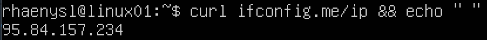
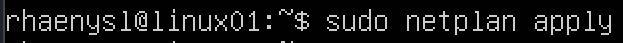

## Part 1. Installation of the OS
 - Installed **Ubuntu 20.04 Server LTS** without GUI. (Using VirtualBox).
 - Checking Ubuntu version by running the command \
    `cat /etc/issue` \
    

## Part 2. Creating a user
 - Added new user `biba` to `adm` group by runnig the command \
    `sudo useradd -G adm biba` \
    
 - Checking if new user was create by runnig command \
    `cat /etc/passwd` \
    

## Part 3. Setting up the OS network
 - Setting the machine name as `user-1` and checking it by runnig the commands \
    `sudo hostnamectl set-hostname user-1` \
    `hostnamectl` \
    
 - Setting the local timezone and check it by running the commands \
    `sudo timedatectl set-timezone Europe/Moscow` \
    `timedatectl` \
    
 - Outputing the names of the network interfaces by the command \
    `ip link show` \
    
 - lo (loopback device) - it's a virtual network device that is on all systems, even if they aren't connected to any network. It has an IP address of `127.0.0.1` and dns-name - `localhost` and can be used to access network services locally. It is used to debug network programs and run server applications on the local machine.
 - Getting the ip of the device you are working on from the DHCP server by command \
    `sudo dhclient enp0s3` \
    `sudo dhclient -v` \
    
 - Dynamic Host Configuration Protocol (DHCP) is a client/server protocol that automatically provides an Internet Protocol (IP) host with its IP address and other related configuration information such as the subnet mask and default gateway.
 - Defining and displaying the external ip address of the gateway (ip) by the command \
    `curl ipconfig.me/ip && " "` \
     \
 - and the internal IP address of the gateway by the command \
    `ip r | grep default | awk 'END{print $3}` \
    
 - Setting static ip, gw and dns by the commands \
    `ls /etc/netplan/` \
     \
    `sudo vi /etc/netplan/00-installer-config.yaml` \
    
     \
    `sudo netplan applay` \
    
 - Rebooting the virtual machine. Making sure that the static network settings \
    `sudo reboot now` \
     \
    `ip r` \
     \
    `resolvectl status | grep 'DNS Server'` \
    
 - Ping 1.1.1.1 and ya.ru \
    `ping -c 5 1.1.1.1` \
     \
    `ping -c 5 ya.ru` \
    

## Part 4. OS Update
 - Getting update by the command \
    `sudo apt update` \
     \
    `sudo apt upgrade`
 - Check if system packages are up to date \
    `sudo apt update` \
    

## Part 5. Using the **sudo** command
 - sudo (substitute user and do) - allows a system administrator to delegate authority to give certain users (or groups of  users) the ability to run some (or all) commands as root or another user while providing an audit trail of the commands and their arguments.
 - Changing the OS hostname via the `biba` (using sudo) \
    `sudo -u biba hostnamectl set-hostname linux-1` \
     \
    `hostname` \
    

## Part 6. Installing and configuring the time service
 - Outputing the time of the time zone in which you are currently located by command \
    `timedatectl show` \
    

## Part 7. Installing and using text editors
 - Installing **VIM**, **NANO** and **JOE** text editors by commands \
    `sudo apt-get update` \
    `sudo apt-get vim` \
    `sudo apt-get nano` \
    `sudo apt-get joe` \
    
 - **VIM** editor make and open `test_vim.txt` add nickname \
    `vim test_vim.txt` \
     \
     
 - **NANO** editor make and open `test_nano.txt` add nickname \
    `nano test_nano.txt` \
     \
    
 - **JOE** editor make and open `test_joe.txt` add nickname \
    `joe test_joe.txt` \
     \
    
 - in **VIM** to exit and saved changes `Esc`, `:wq` and `Enter`
 - in **NANO** to exit and saved changes `Ctrl` + `X`, `Y`, edit filename if needed and `Enter`
 - in **JOE** to exit and saved changes `Ctrl` + `K` + `X`
 - **VIM** open to edit `test_nano.txt` \
    
 - in **VIM** to exit without savig changes `Esc`, `:q!` and `Enter`
 - **NANO** editor open to edit `test_nano.txt`  \
    
 - in **NANO** to exit without savig changes `Ctrl` + `X`, `N`
 - **JOE** editor open `test_joe.txt` \
    
 - in **JOE** to exit without savig changes `Ctrl` + `K` + `Q` and `N`    

 - **VIM** search result \
    
 - **VIM** replace result \
    
 - **JOE** search result
    `Ctrl` + `K`, `F` then type the word `file` \
    
 - **JOE** replace result \
    `r`, `Enter`, then type the word `elif` and then `y` to replace \
    
 - **NANO** search result
    `Alt` + `R` then type the word `file` and `Enter` \
    
 - **NANO** replace result \
    `elif` and `Enter` and then `y` \
    

## Part 8. Installing and basic setup of the **SSHD** service
 - Installing OpenSSH server by the command \
    `sudo apt install openssh-server` \
    
 - Adding an auto-start of the service by the command \
    `sudo systemctl enable ssh.service` \
    
 - Reset the SSHd service to port 2022 by the command \
    `sudo nano /etc/ssh/sshd_config` \
     \
    `sudo systemctl restart ssh` \
    `sudo systemctl status ssh | grep port` \
    
 - Showing sshd process    
    `ps axu | grep sshd` \
    
 - ps (process status) displays information about a selection of the active processes. Using diffirent options to display what you need:
    a | include processes belonging to other users \
    x | include processes with no controlling terminal \
    u | output in resource usage ("user-oriented") format \
    grep sshd | display only processes with sshd string
 - Reboot the system by the command \
    `sudo reboot now`
 - Outputing repor of the active internet connection by the command \
    `netstat -tan`
    
 - Options meaning: \
    t | show only tcp protocol \
    a | adds all listening protocol (both TCP and UDP) and any other TCP pseudo-connections \
    n | makes all ports and IP addresses numerical instead of named (127.0.0.53 instead of localhost)
 - **Column value:** \
    **Proto** | The protocol (tcp, udp, raw) used by the socket \
    **Recv-Q** | The  count  of  bytes  not copied by the user program connected to this socket \
    **Send-Q** | The count of bytes not acknowledged by the remote host \
    **Local Address** | Address and port number of the local end of the socket. Unless the --numeric (-n) option is specified, the socket address is resolved to it's canonical host name (FQDN), and the port number is translated into the corresponding service name \
    **Foreign Address** | Address and port number of the remote end of the socket.  Analogous to "Local Address" \
    **State** | The state of the socket. Since there are no states in raw mode and usually no states used in UDP, this column may be left blank.Normally this can be one of several values: LISTEN, ESTABLISHED, CLOSE, UNKNOWN etc
 - **0.0.0.0** on the Local Address column means that port is listening on all network interfaces (i.e. your computer, your modem(s) and your network card(s))

## Part 9. Installing and using the **top**, **htop** utilities
 - htop command output sorted by: \
    **PID** \
    
    **PERCENT_CPU** \
    
    **PERCENT_MEM** \
    
    **TIME** \
    
 - htop filtered for sshd \
    
 - htop searech for syslog \
         
 - htop hostname, clock and uptime output added \
    

## Part 10. Using the **fdisk** utility
 - name of the harddisk: dev/sda
 - dev/sda capacity: 10Gb
 - number of sectors: 20971520
 - swap size: 1.5Gb \
    
    

## Part 11. Using the **df** utility
 - df print sizes in 1kB units \
    
 - df -Th print sizes in powers of 1024 (e.g., 1023M) \
    

## Part 12. Using the **du** utility
 - in human readable format \
    
 - in bytes \
    
 - the size of all contents in /var/log \
    

## Part 13. Installing and using the **ncdu** utility
 - Install the ncdu utility \
    `sudo apt install ncdu` \
    
 - `nsdu /home` \
    
 - `ncdu /var` \
    
 - `ncdu /var/log` \
    

## Part 14. Working with system logs
 - Write the last successful login time, user name and login method \
    
 - `tail -f -n 20 /var/log/auth.log | grep -i sshd` \
    

## Part 15. Using the **CRON** job scheduler

 - Using the job scheduler, run the uptime command in every 2 minutes.
    `crontab -e` \
    
 - **CRON** syslog execution lines \
    
 - Remove all tasks from the job scheduler.
    `crontab -l` \
    